# 🎓 BonusPoints – Secure Student Bonus Points Management App

BonusPoints is a **security-focused Android application** built for academic institutions to securely manage and track student bonus points.  
It implements **multi-faculty authentication**, **subject-scoped RBAC**, **secure session management**, and **encrypted credential handling** to ensure **100% subject-wise data isolation** and strict access control.

This app follows modern Android security principles and includes **audit-ready logs**, protected CRUD operations, and strong input validation — making it perfect for institutions digitizing student evaluation processes.

---

## 🔑 Key Features

- 🔐 **Multi-Faculty Authentication** (Admin + individual subject-wise faculty accounts)
- 🛡 **SHA-256 Password Hashing with Salt**
- 🧩 **Subject-Scoped RBAC** ensuring 100% cross-subject isolation
- 🗄️ **Secure SQLite Data Storage**
- 📝 **Protected CRUD operations** with access-level permissions
- 📊 **Audit logging** for accountability & compliance
- 🧪 **40+ penetration tests** passed with 100% attack mitigation
- ⚡ Optimized performance with < 5.2% security overhead

---

## 📥 Download APK

👉 **[Download v1.0.0 Release APK](../../releases/latest/download/app-release.apk)**

(Hosted on GitHub Releases)

---

## 📱 App Screenshots

### 🔧 Admin Setup
| Admin Setup | Faculty Added |
|------------|---------------|
|  | 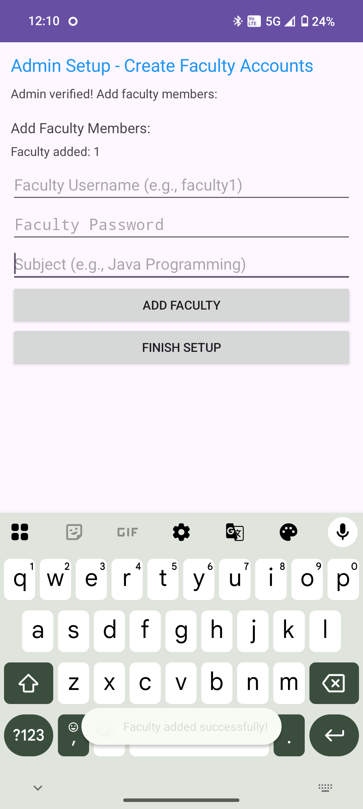 |

---

### 🔐 Login & Credentials
| Login Screen | Demo Credentials |
|--------------|------------------|
| 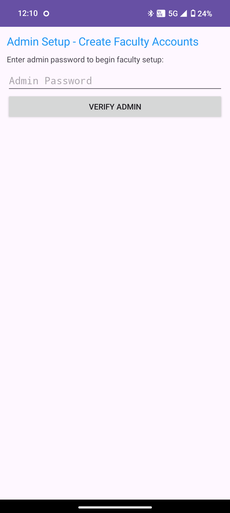 | 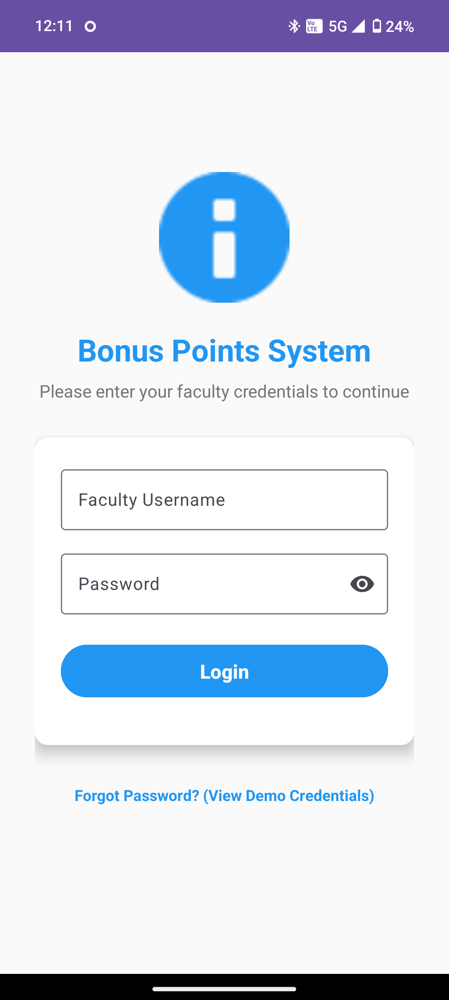 |

---

### 🏠 Dashboard & Navigation
| Dashboard | Award Points |
|-----------|--------------|
| 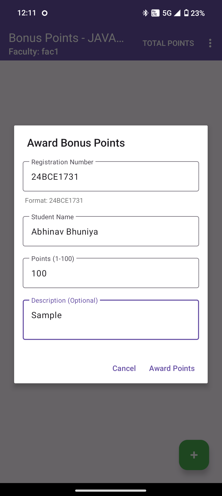 | 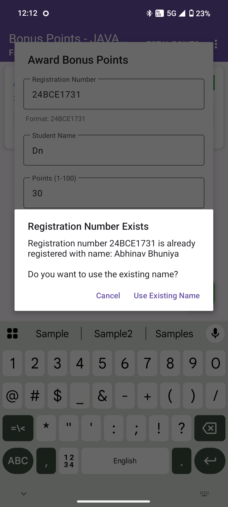 |

---

### 🎓 Student Records
| Registration Exists | Student Details |
|----------------------|-----------------|
| 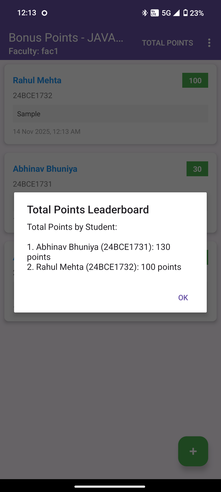 | 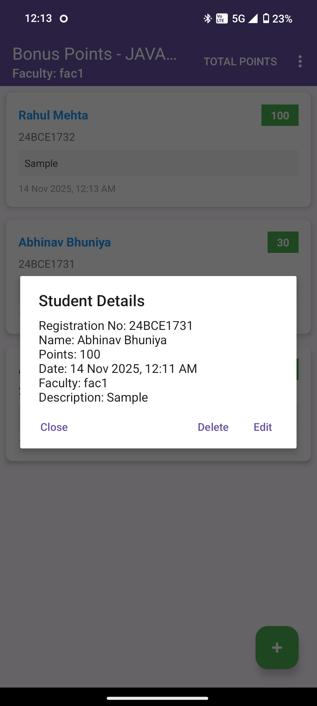 |

---

### 🏆 Leaderboard & Logout
| Leaderboard | Logout |
|-------------|--------|
| 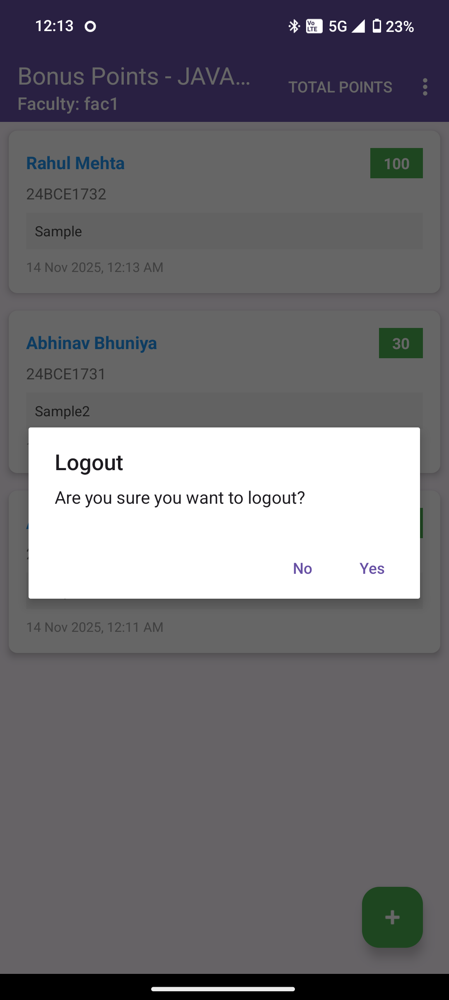 | 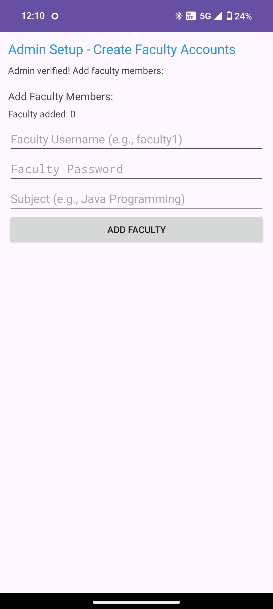 |

---

### ➕ Add Faculty (Extra Screenshots)
| Add Faculty | Confirmation |
|--------------|-------------|
| 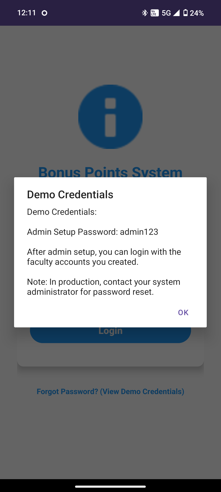 | 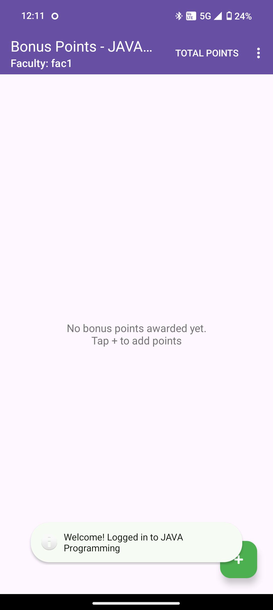 |

---

## 🛠️ Tech Stack

| Component | Technology |
|----------|------------|
| Language | **Java (Android)** |
| Database | **SQLite** |
| Security | **SHA-256 Hashing, RBAC, Validation** |
| UI | **Material Design Components** |
| Architecture | **3-Tier (UI → Logic → Data)** |

---

## 📂 Project Structure

BonusPoints-App/
│── app/
│── assets/
│ └── screenshots/
│── docs/
│── LICENSE
│── README.md
│── CHANGELOG.md
│── .gitignore

---

## 🚀 How to Build

### **1. Clone the repository**
bash
git clone https://github.com/abhinavbhuniya/BonusPoints-App.git

2. Open in Android Studio
File → Open → Select project folder.

3. Build the project
Build → Make Project

4. Run on emulator or device
Run → Run 'app'

📌 License
This project is licensed under the MIT License.
See LICENSE for details.

💬 Feedback & Contributions
Contributions, issues, and feature requests are welcome!
Feel free to open an issue or submit a pull request.
